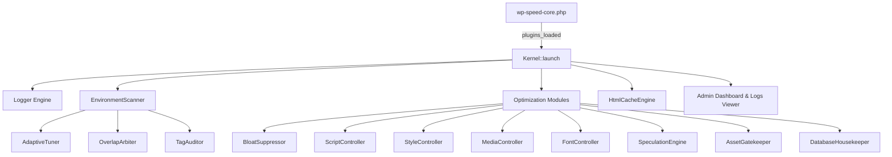

# ⚡ WP Speed Core - Antigravity Agent Workflow & Engineering Rules

> **Referensi**: Mengadopsi prinsip-prinsip rigorous engineering dari [mattpocock/skills](https://github.com/mattpocock/skills) yang diselaraskan secara spesifik dengan arsitektur **Antigravity CLI (AGY)** dan **Antigravity Skills System**.

---

## 1. 🎯 Relevansi Matt Pocock Skills terhadap Antigravity

Repo `mattpocock/skills` berfokus pada **Agent Grounding**, **Anti-Vibe-Coding (Anti-Halusinasi)**, **Test-Driven Discipline**, dan **Interactive Alignment (Grill-Me)**. Dalam ekosistem **Antigravity**, prinsip-prinsip ini diwujudkan melalui:

| Konsep Matt Pocock | Integrasi di Antigravity | Implementasi di WP Speed Core |
| :--- | :--- | :--- |
| **`grill-me`** | Mengajukan pertanyaan klarifikasi sebelum menulis kode arsitektur besar (`ask_question` / slash command `/grill-me`). | Digunakan saat menentukan batas agresivitas JS delay, level Speculation Rules, dan kebijakan purge cache. |
| **`anti-vibe-coding`** | Menolak asumsi tidak berdasar, wajib memvalidasi API resmi, dan memverifikasi integritas file pasca-edit. | Wajib menggunakan `WP_HTML_Tag_Processor` (WP 6.2+) alih-alih regex DOM parsing rapuh. |
| **`phased-refactoring`** | Memecah perubahan besar menjadi modul-modul independen yang dapat diuji satu per satu. | Pembagian arsitektur ke dalam Service Container singleton (`Kernel`) dan 9 modul terisolasi. |
| **`tdd-discipline`** | Validasi sintaks, tipe data strict (`declare(strict_types=1)`), dan verifikasi nol error. | Audit UTF-8, sanitasi SQL, sanitasi HTML escaping, proteksi CSRF nonce, dan logging diagnosa. |

---

## 2. 🛡️ Security & Hardening Protocols

1. **CSRF & Access Control**:
   - Seluruh mutasi state admin (Auto-Tune, Purge Cache, Clear Logs) wajib divalidasi dengan `check_admin_referer()` dan `current_user_can('manage_options')`.
   - Method `render()` wajib memblokir unauthorized user dengan `wp_die(esc_html__('Akses ditolak.', 'wp-speed-core'))`.

2. **Cross-Site Scripting (XSS) Prevention**:
   - Semua output variabel dinamis wajib di-escape menggunakan `esc_html()`, `esc_attr()`, `esc_textarea()`, atau `wp_json_encode(..., JSON_UNESCAPED_SLASHES)`.

3. **SQL Injection Prevention**:
   - Seluruh query ke `$wpdb` wajib dibungkus oleh `$wpdb->prepare()`.
   - Menggunakan wildcard escaping `$wpdb->esc_like()` untuk pembersihan transient.

4. **Directory & Log File Hardening**:
   - Direktori cache dan log (`/wp-content/cache/wp-speed-core/logs/`) dilindungi oleh `.htaccess` (`Deny from all`) dan `index.php` kosong untuk mencegah akses langsung via URL browser.
   - Rotasi otomatis berkas log (maksimal 1 MB) untuk mencegah disk bloat.

5. **Regex & DoS Hardening**:
   - Menghindari catastrophic backtracking pada pattern regex tag auditor.
   - Menggunakan limit ukuran buffer (minimal 200 karakter) sebelum memproses payload HTML.

---

## 3. ⚡ Core Web Vitals & INP Shield Standard

1. **INP Yielding Standard**:
   - Skrip yang dieksekusi secara deferred tidak boleh memblokir main thread lebih dari 50ms per frame.
   - Wajib menggunakan `scheduler.yield()` native dengan fallback `setTimeout(resolve, 0)`.
   - Menjaga sequential dependency order skrip eksternal dengan Promise event handler.

2. **LCP Hero Auto-Prioritization**:
   - Gambar pertama dalam viewport above-the-fold otomatis mendapatkan atribut `fetchpriority="high"` dan `loading="eager"`.

---

## 4. 🏛️ Module Architecture & Boot Order

